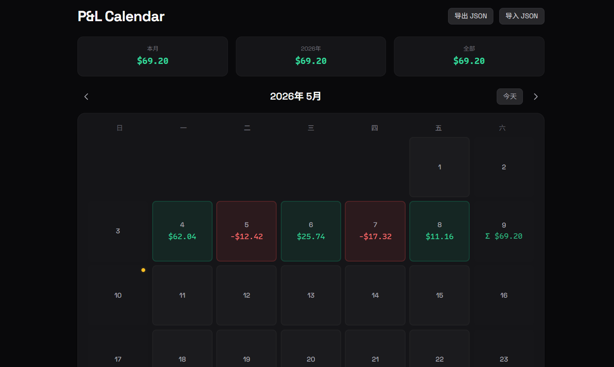

# P&L Calendar

本地交易盈亏日历记录工具 — 纯前端、零依赖（除 Tailwind CSS CDN）、数据完全本地存储。

## 功能

- **月度日历视图** — 周日起始，支持上/下月切换，一键回到今天
- **盈亏记录** — 点击任意周一至周五日期，输入当日 P&L 金额和交易备注
- **自动着色** — 盈利绿色、亏损红色、无交易灰色；周末自动置灰不可编辑
- **周合计** — 每周六格内显示当周（周日至周六）累计盈亏
- **统计面板** — 本月 / 今年 / 全部总盈亏卡片；高级统计含交易天数、胜率、平均盈利/亏损、盈亏比、最佳/最差日、连续盈亏
- **每日盈亏图** — Canvas 绘制的本月每日柱状图
- **导入/导出** — JSON 格式备份与恢复
- **键盘操作** — `←` `→` 切换月份，`Esc` 关闭弹窗，`Enter` 保存
- **响应式设计** — 桌面优先，移动端友好

## 截图



## 技术栈

- HTML + CSS + JavaScript（ES6+）
- [Tailwind CSS](https://tailwindcss.com/)（CDN）
- [Space Grotesk](https://fonts.google.com/specimen/Space+Grotesk)（英文） + [Noto Sans SC](https://fonts.google.com/specimen/Noto+Sans+SC)（中文）
- 数据存储：`localStorage`（key: `pnlCalendar`）

## 使用方式

直接在浏览器中打开 `index.html` 即可使用，无需安装或构建。

## 数据结构

```json
{
  "2026-05-01": { "pnl": 1250.75, "note": "日内突破交易" },
  "2026-05-02": { "pnl": -450.00, "note": "止损调整不当" }
}
```

## 项目结构

```
tradeforge-calendar/
├── index.html          # 主应用文件（内嵌所有 CSS 和 JS）
├── pnl-calendar-spec.md # 产品规格说明
└── README.md
```
